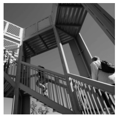

# February 21st Informal Response- Alleah Thornhill

## Convolutions

### Last time you did an exercise (convolutions and pooling) where you manually applied a 3x3 array as a filter to an image of two people ascending an outdoor staircase. Modify the existing filter and if needed the associated weight in order to apply your new filters to the image 3 times. Plot each result, upload them to your response, and describe how each filter transformed the existing image as it convolved through the original array and reduced the object size. 

Original image: 



#### Filter 1: 

```
filter = [ [0, 1, 0], [1, -4, 1], [0, 1, 0]]
```


The first filter appears to highlight horizontal lines, in effect significantly darkening the original image.

#### Filter 2:

```
filter = [ [-1, -2, -1], [0, 0, 0], [1, 2, 1]]
```


This second filter appears to highlight vertical lines, causing them to stand out in stark contrast to the darkened background.

#### Filter 3:

```
filter = [ [-1, 0, 1], [-2, 0, 2], [-1, 0, 1]]
```


The third filter appears to highlight diagonal lines much more clearly than the previous two filters.


### What are you functionally accomplishing as you apply the filter to your original array? 

When we apply a filter to an array, we are functionally iterating over each pixel in the image and multiplying its neighbors by each of the values defined in the 3x3 radius of the filter. This leaves us with a resulting image that is impacted by having specific features of the image emphasized 

### Why is the application of a convolving filter to an image useful for computer vision? 

This is useful for computer vision as it allows a model to use certain defining features of an object (such as the horizontal line that forms the sole of a shoe) to better assign objects versus when using a classifier.

#### Stretch goal: instead of using the misc.ascent() image from scipy, can you apply three filters and weights to your own selected image? Again describe the results.


## Pooling

### Another useful method is pooling. Apply a 2x2 filter to one of your convolved images, and plot the result. 

#### Original vs. pooled image

 

### In effect what have you accomplished by applying this filter? Does there seem to be a logic (i.e. maximizing, averaging or minimizing values?) associated with the pooling filter provided in the example exercise (convolutions & pooling)? 
This filter had the effect of emphasizing the most important values that remained after applying the third filter, making most of the lines appear both thicker and in greater contrast than before. The logic behind the pooling filter is to reduce the overall size of the image by iterating over a 2x2 block of pixels and saving the highest value within this block; this preserves the most important features and points within the image.

### Did the resulting image increase in size or decrease? Why would this method be useful? 

The resulting image size was 1/4 that of the original. This is useful because it saves the amount of space needed to store iterations of images when working with large datasets, reducing the size of the resulting images by 75%.

#### Stretch goal: again, instead of using misc.ascent(), apply the pooling filter to one of your transformed images.
