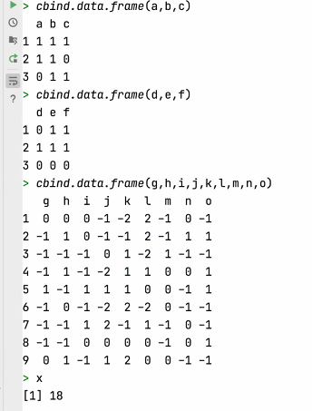
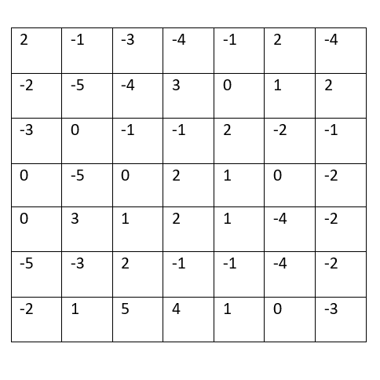
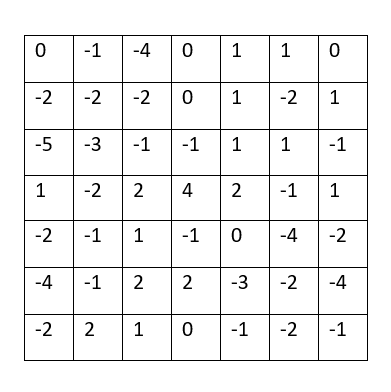

## Convolutions

### Convolve the two 3x3 matrices that were assigned to you with your 9x9 matrix and calculate the resulting two matrices

#### Original matrices

#### Filter 1 Output

#### Filter 2 Output

### What is the purpose of using a 3x3 filter to convolve across a 2D image matrix?

The purpose of using a filter to convolve across a 2D image is to reduce the size of the image while retaining the most important features within that image. This makes filters a useful tool in image processing, especially when running machine learning models on large datasets.

### Why would we include more than one filter? How many filters did you assign as part of your architecture when training a model to learn images of numbers from the mnist dataset?

We may want to include more than one filter if you are trying to highlight different features within an image. For example, if you were trying to highlight the defining features of a boot, you may want to highlight both the horizontal lines that comprise the sole and vertical lines that make up the shaft that are features in a typical boot. I assigned one filter as a part of my architecture to train a model to learn images from the mnist dataset.

## MSE
