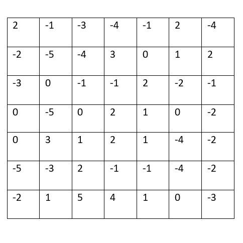
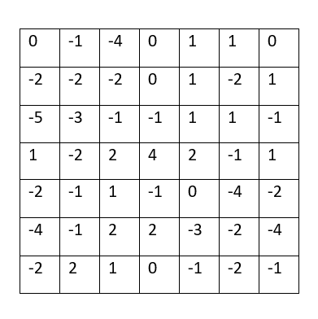

## Convolutions

### Convolve the two 3x3 matrices that were assigned to you with your 9x9 matrix and calculate the resulting two matrices

#### Original matrices

#### Filter 1 Output

#### Filter 2 Output

### What is the purpose of using a 3x3 filter to convolve across a 2D image matrix?

The purpose of using a filter to convolve across a 2D image is to reduce the size of the image while retaining the most important features within that image. This makes filters a useful tool in image processing, especially when running machine learning models on large datasets.

### Why would we include more than one filter? How many filters did you assign as part of your architecture when training a model to learn images of numbers from the mnist dataset?

We may want to include more than one filter if you are trying to highlight different features within an image. For example, if you were trying to highlight the defining features of a boot, you may want to highlight both the horizontal lines that comprise the sole and vertical lines that make up the shaft that are features in a typical boot. I assigned one filter as a part of my architecture to train a model to learn images from the mnist dataset.

## MSE

### From your 400+ observations of homes for sale, calculate the MSE for the following.

#### The 10 biggest over-predictions

The Mean Squared Error is: 1.3602971425776497e+27

#### The 10 biggest under-predictions

The Mean Squared Error is:  3.8213090147855534e+18

#### The 10 most accurate results (use absolute value)

The Mean Squared Error is:  2.5568076474114e+18

#### In which percentile do the 10 most accurate predictions reside? Did your model trend towards over or under predicting home values?

My most accurate predictions resided within the 10-87th percentiles. My model tended to trend very heavily towards over predicitng home values, with several of my most expensive home being within this criteria.

#### Which feature appears to be the most significant predictor in the above cases?

From looking at my data with the most accurate predictions, it would seem that number of bedrooms is the most significant predictor of house prices in this area.

#### Stretch goal: calculate the MAE and compare with your MSE results

MAE: 1280706111882.2798 

#### Updated

 do go back and correct those previous answers, but just make a note of what happened, how you changed it, and how your modified data improved the results

After noticing some irregularities in my data, I noticed that my scrape of the house prices from zillow did not do so correctly; for example, if the price was listed at '75,500', the price was scraped as '7550075500' or something similar. To clean up the data, I had to go back and edit the parameters for slicing the data, slicing the data up to six digits; after this, I went line by line to correct the remaining points that were under six digits, still coming up as '755007'. 

### The updated results were as follows:

#### The 10 biggest over-predictions

The MSE is: 349,438,177,494.59

#### The 10 biggest under-predictions

The MSE is: 62,754,799,484.84

#### The 10 most accurate results (use absolute value)

The MSE is: 8,659,861.82

Relatively, the MSE for the biggest under-predictions was better than the biggest over-predictions, and the MSE for the most accurate results performed the best by far. This is not surprising, as the most accurate results are more likely to have a lower difference between predicted and actual house prices.

#### In which percentile do the 10 most accurate predictions reside? Did your model trend towards over or under predicting home values?

My 10 most accurate predictions resided within the top 96th percentile of my data, performing better than a significant majority of the homes. With this in mind, its easier to see how my model tended to trend significanly towards over-predicting home values, with only 154 homes out of 385 being a good deal according to the model.

#### Which feature appears to be the most significant predictor in the above cases?

With this current model, it appears that the number of bedrooms within a home influences the prediction of house prices more significantly than any other factor.

#### Stretch goal: calculate the MAE and compare with your MSE results

MAE: 140532.78
MSE (entire dataset): 34760038746.69

Correcting my dataset improved the Mean Absolute Error data by a significant amount; it also resulted in a much smaller value than the MSE of all of the prices vs predictions. Because MAE is not very sensitive to outliers in the data, this may not capture the full picture in regards to directionality that is represented in MSE.

