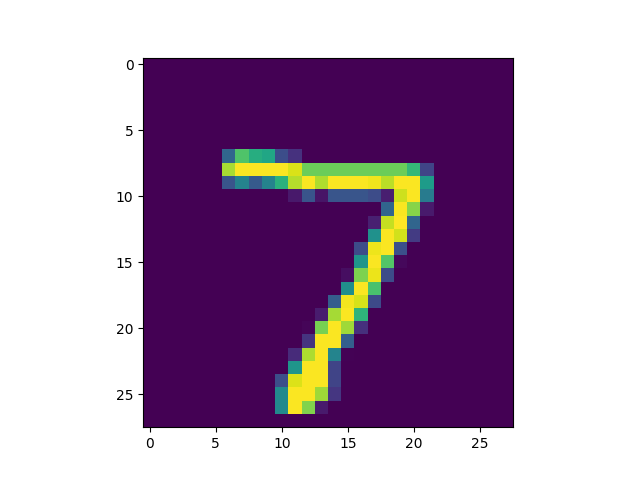
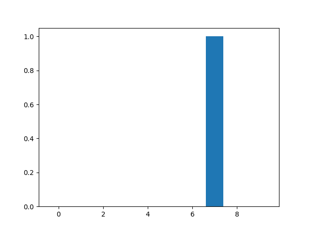

# Informal Response Feb. 8th - Alleah Thornhill

## In the video, First steps in computer vision, Laurence Maroney introduces us to the Fashion MNIST data set and using it to train a neural network in order to teach a computer “how to see.” One of the first steps towards this goal is splitting the data into two groups, a set of training images and training labels and then also a set of test images and test labels. Why is this done? What is the purpose of splitting the data into a training set and a test set?
-	This is done to have the ability to test the model on data it has not seen before. If we did not split the data into a training/testing set, and ran the model using the whole dataset, we may be under the false impression that the model is performing better than it actually is, when in reality it is most likely getting overfit to this specific dataset, with no knowledge of how it would perform when being used in the real world.

## The fashion MNIST example has increased the number of layers in our neural network from 1 in the past example, now to 3. The last two are .Dense layers that have activation arguments using the relu and softmax functions. What is the purpose of each of these functions. Also, why are there 10 neurons in the third and last layer in the neural network.
-	The relu function has the purpose of eliminating negative outputs so that they don’t skew the results of positive outputs down the line. Softmax helps to find the most likely candidate by setting the class with the highest likelihood to 1, and the rest to zero.
-	There are 10 neurons in the last layer because there are 10 different types of clothing in the dataset; each of these neurons have the job of determining the likelihood that a piece of clothing falls under this particular class.
## In the past example we used the optimizer and loss function, while in this one we are using the function adam in the optimizer argument and sparse_categorical- crossentropy for the loss argument. How do the optimizer and loss functions operate to produce model parameters (estimates) within the model.compile() function?
-	The loss function is a way to evaluate how good or bad a “guess” made by the model is, with this information being used by the optimizer to improve the guess before being sent through the loss function again. This cycle is how the model.compile() function works to produce model parameters.
##Using the mnist drawings dataset (the dataset with the hand written numbers with corresponding labels) answer the following questions.
## What is the shape of the images training set (how many and the dimension of each)
-	There are 60,000 images in the training set, with dimensions of 28 by 28.
## What is the length of the labels training set?
-	The length of the labels training set is also 60,000.
## What is the shape of the images test set?
-	The shape of the images test set is 10,000, with 28 by 28 dimensions.

## Use np.argmax() with your predictions object to return the numeral with the highest probability from the test labels dataset.
  
  - My function returned a numeral of 7.

•	Produce a plot of your selected image and the accompanying histogram that illustrates the probability of that image being the selected number

