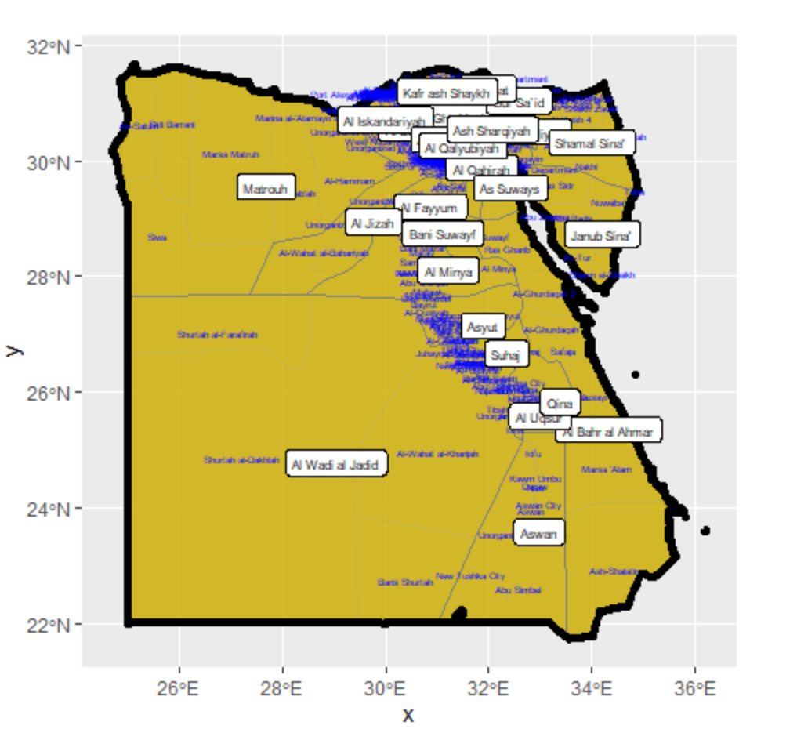

## Egypt Data

## March 10th

#### Raw

#### Normal

#### Percent

#### Scale

## March 22nd

### Raster Data

[Summary Statistics](https://github.com/alleahsoleil/Applied_Machine_Learning/blob/36fb5bed9d667e2e8ef9a295d842045edf3a95dd/sum_stats.csv)
