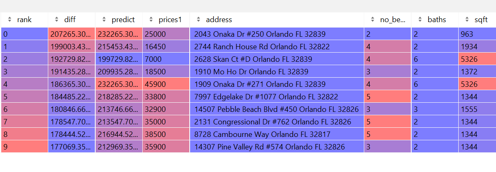

# Project One - Alleah Thornhill

### Select a city and scrape as many observations as possible from zillow. Try to obtain at least 400 observations from your selected location. Clean the housing data you obtained and create a number of usable features (independent variables) and targets (dependent variables). Set price as the response variable, and then set numbers of beds, number of bathrooms and total square footage as the predictors. Following the previous model you specified (6 houses in Mathews), import your new data set and train a new model on your target and features.

#### A description of the housing data you scraped from Zillow

The city I selected for this project was **Orlando, Fl.** Initially I began with exactly 400 observations for this city, but after cleaning the data for missing values, I ended up with a total of 385 observations in this dataset.

#### Descriptive Statistics for Orlando Housing Data

|        | prices_scale  |   no_beds    |     sqft    |   diff |
| count  |  385   | 385   |  385     |   385       |
| mean   |  3.136 | 3.740 | 2245.210 |-103243.786  |
| std    |  1.796 | 1.048 | 1086.993 | 177794.573  |
| min    |  0.070 | 2.000 | 890.000  | -793725.629 |
| 25%    |  1.850 | 3.000 | 1344.000 |-189887.270  |
| 50%    |  2.950 | 4.000 | 1936.000 |-101012.654  |
| 75%     | 3.999 | 4.000 | 2973.000 | 20290.930   |
| max     | 9.950 | 6.000 | 5326.000 | 207265.306  |

	A description of your model architecture
  
  In our analysis of housing price data for specific cities, our first step was to obtain information for house listings posted on Zillow-- specifically in the Orlando area in my case. Next, we processed and cleaned the data by removing unnecessary tags and information and extracting just the price, address, square footage, number of bedrooms, and number of bathrooms from the raw data, now converting it into a csv file.
  After this, the information we parsed was put into a table, where we could then begin analysis of the data after scaling some features (square footage and price). This model works by taking the sqaure footage, number of bedrooms, and number of bathrooms as input for predictors, and uses this information to make a prediction of house prices as the target. We accomplished this by utilizing Tensorflow, which allowed us to train and compile the model on a neural network comprising of a single Dense layer that optimized loss using mean squared error based on the inputs of the three aforementioned features. After the model ran for 500 epochs, the output of these predictions were stored within another column in the dataframe. 
  These predicted house prices can then be compared with the actual listing prices of the house, allowing us to get a sense of how accurate our data is.
  

This plot shows the loss that was figured by the model over 500 epochs. The average loss remained minimal, averaging around 3.

The MSE of the actual vs predicted outcomes was 43010254295.87, while the MAE was 155718.32, and the average difference in means being -103,243.79. All of this taken together shows how inaccurate my model was at predicting house prices, often undervaluing homes by over $100K. 
This finding can be better visualized using the following scatterplot:

From observing this plot, it can be seen how the predicted housing price almost never increased as the actual housing prices increased, suggesting that there is another important feature of housing prices that area not currently captured in our model. A clear factor that is overlooked in the original model is the dimension of location, a feature that can be examined further later.

To determine the fairness of housing prices, we calculated the differences by taking the predicted house price from the model and subtracting it by the actual listed price. Thus, homes that had a difference value that was negative were overpriced, and homes that had a value that was positve were underpriced.
Out of the 385 observations, there are 113 houses that were determined by the model to be underpriced (29.35% of the data), while the remaining 272 houses were deemed to be overpriced (70.65% of the data). The house that was determined to be the best deal was a 963sqft 2-bed 2-bath house on Onaka Dr. in Orlando that's predicted price was set at $232,265K, while it's actual asking price sat at only $25,000-- a savings of over $200K. 
On the other hand, the worst valued home was a 4502sqft house on New Hope Road with 6 beds and 4 baths that was priced at $995,000, while the model predicted it should have only been about $201,274K, making it overpriced by almost $800K.

       

### Top 10 best and worst priced homes on the market in Orlando, FL

     

