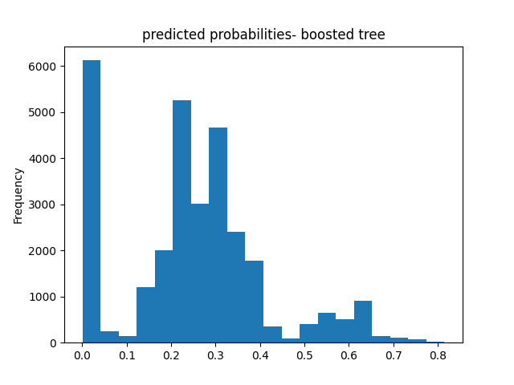

### Data: Egypt 2014 Standard DHS

## Logistic Regression In R

The model that performed the best was the third slice with a penalty of .000161, and an AUC of .648.

To optimize the penalty value, I chose the slice at 11 with an AUC value of .646. While this value is slightly smaller than the highest value at slice 1, the slice at 11 allows us to obtain a much higher penalty with only a reasonable loss in performance. 
However, while I believe that slice 11 was the best selection from this data, I am unsure whether it created a significant difference in the results, as the AUC was not significantly different from a few of the values above and below it. Nonetheless, I believe this optimization did help to eliminate some extraneous values.

Below are the plots of my penalized logistic regression model attempting to predict the five wealth outcomes.

From observing the plots, it appears that my model predicts outcomes the best at either of the wealth extremes. However, my model did not perform very well when looking at the three inner groups, with all three being predicted barely above chance. This suggests that there may be room for improvement with the model by combining the subgroups 2-4 into one larger group, as maybe they're too similar to accurately distinguish between; this would likely improve the model to look more similar to its strength in predicting wealth of the highest and lowest incomes. 

## Random Forest In R

Here is my plot of the number of randomly selected predictors, as well as minimal node size for my random forest model:

While the difference is only minimal, it should be noted that my random forest model performed better for predicting each of the wealth outcomes by some degree.

Once again, my model does significantly better at predicting the wealth outcomes at either extreme than it does those of a more intermediate level, showing that the model would benefit from a combined wealth observation for income levels 2-4. From observing the plots above, it can be seen that age is the most important relative factor in predicting wealth, with gender being the least important factor.

## Logistic Regression In Python (tensorflow)
    
 #### Graph of wealth distribution between classes
    
   
    

| metric   | score |
| ----------- | ----------- |
| accuracy      |   0.777357 |
| accuracy_baseline   |  0.755272 |
| auc                  |   0.750641 |
| auc_precision_recall   |   0.479825 |
| average_loss           |   0.471020 |
| label/mean             |   0.244728 |
| loss                   |   0.471020 |
| precision              |   0.634740 |
| prediction/mean       |    0.249362 |
| recall              |      0.212558 |
| global_step          |   100.000000 |

From observing the ROC curve, it can be seen that this model does a decent job of predicting the different distributions of weatlth. With an AUC of .75, this model performs much better than that of Models 1 and 2.

## Gradient Boosting Model In Python

| metric   | score |
| ----------- | ----------- |
| accuracy    |    0.777855 |
| accuracy_baseline |    0.755272 |
| auc                |     0.773416 |
| auc_precision_recall  |    0.510188 |
| average_loss |      0.451515 |
| label/mean |         0.244728 |
| loss |         0.451515 |
| precision |        0.623589 |
| prediction/mean |        0.244723 |
| recall |        0.232808 |
| global_step |      100.000000 |

Overall, the general shape of this predicted probability model mimics the general shape of that from Model 3, but has a bit more variation in values while still showing the model performed better than chance. 

This ROC curve shows that this model performs decently on predicting the various levels of wealth, outperforming that of Model 3 just slightly, reflecting an AUC value of .77 compared to the previous model's .75. 

### Final Model Evaluations

From evaluating the evaluation metrics for all four models, it can be determined that the gradient boosting model produced the best results with an accuracy of about 78%, followed closely by the logisic regression model that was only behind by about .00005 (a difference that could be negligible). With this being said, these models only does an only an okay job of accurately determining various categories of weatlth when comparing it with the ideal of their AUC being close to 1. A consistent trend througout all of my models was their struggle in accurately predicting wealth of only moderate levels, with all of them performing their best at extremes. This discrepency is most likely from the fact there is likely more separating those at opposite ends of the income scale than those who are more moderately aligned, making it more difficult to predict. With addition of various factors (such as location) that we hadn't previously accounted for into the model, it is likely that we can produce results that more accurately reflect the wealth distributions in Egpyt.

