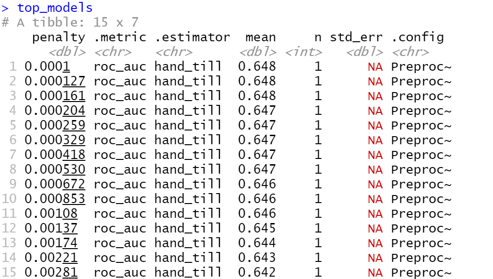
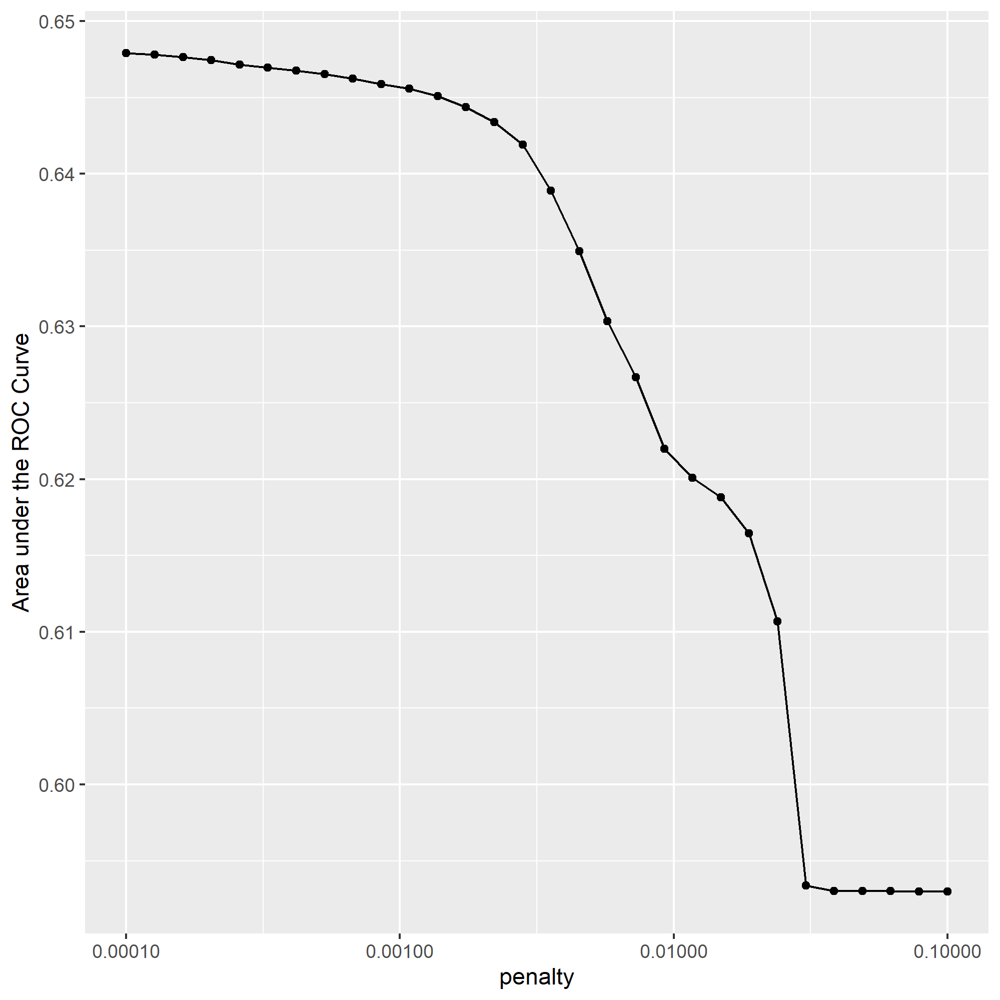
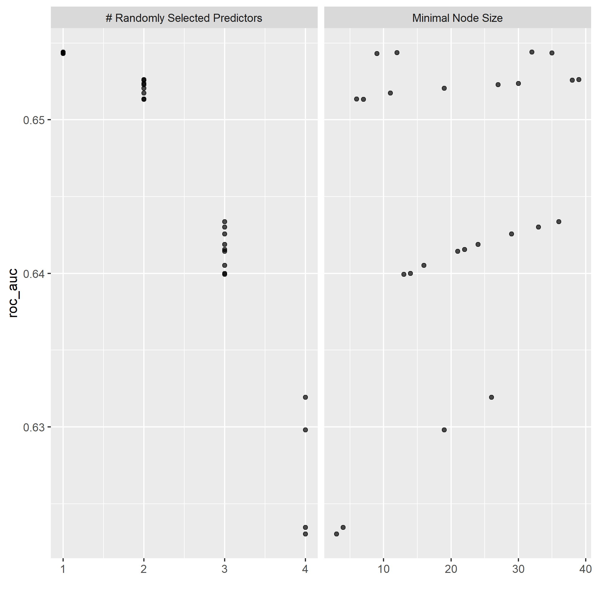
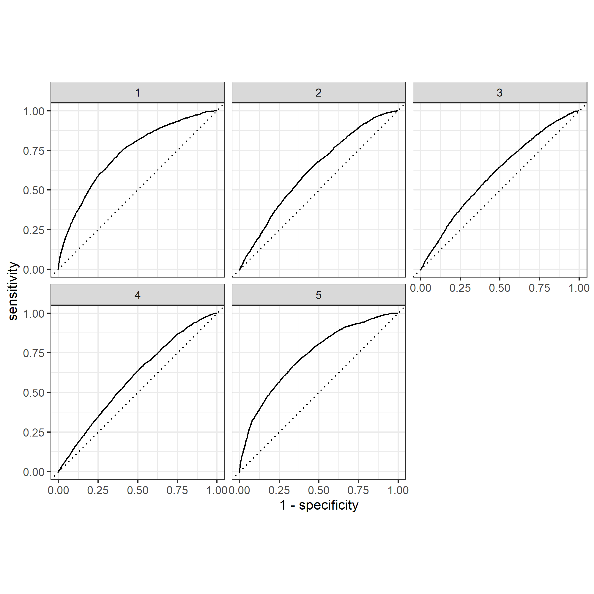
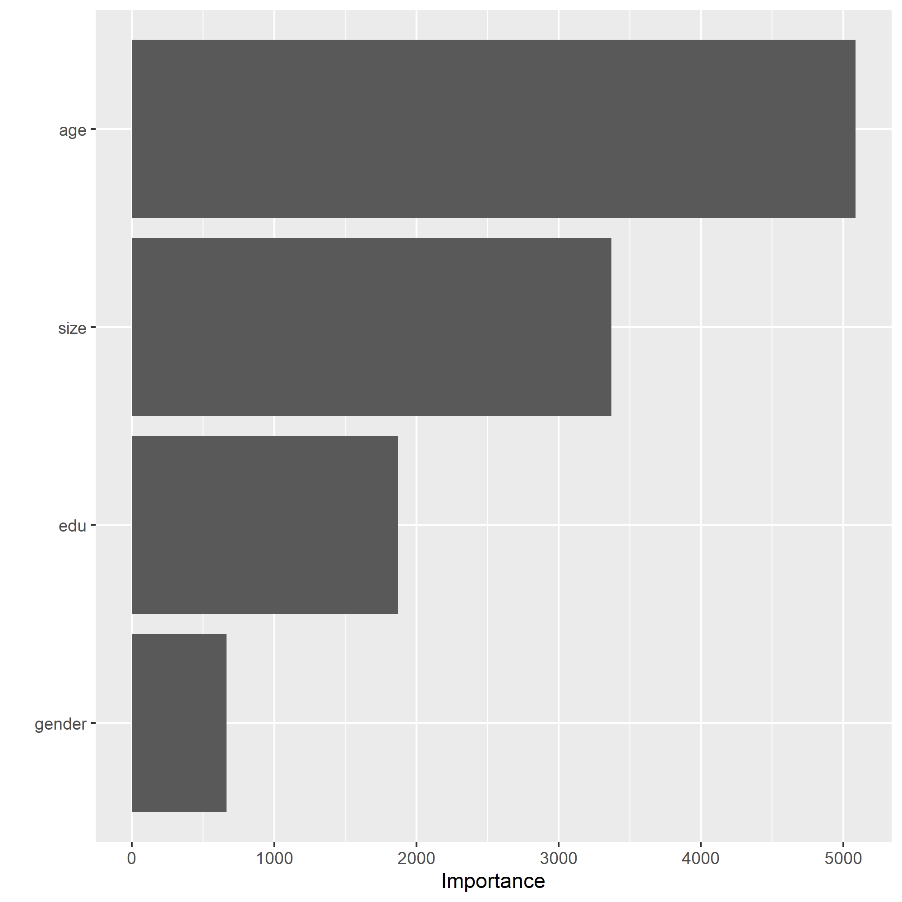
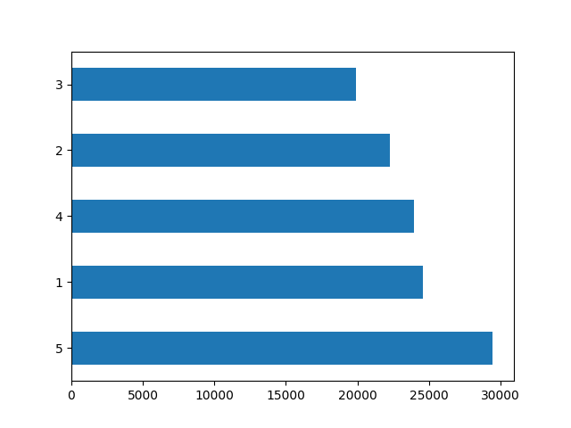
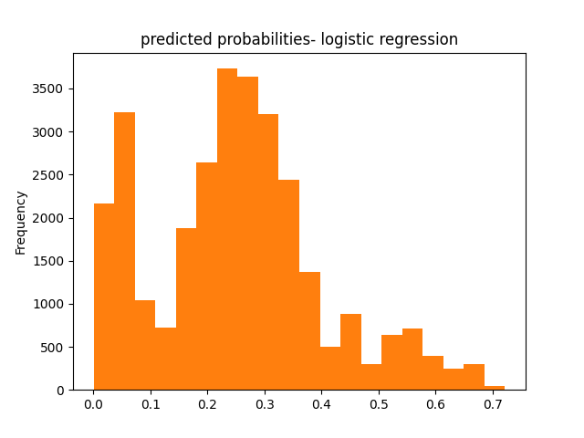
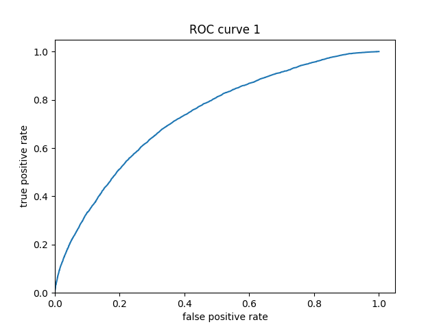
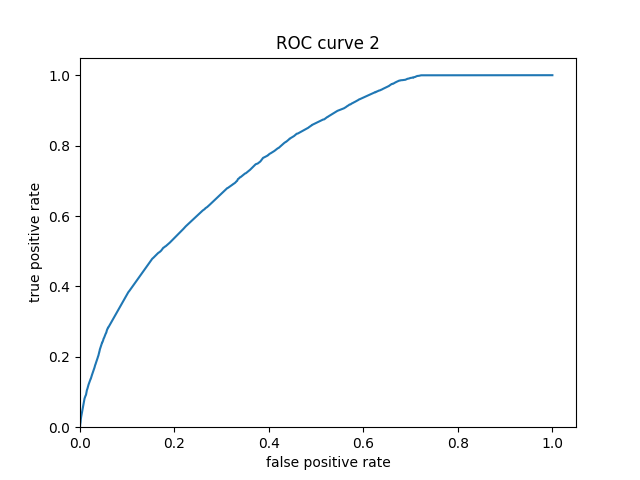

## Logistic Regression In R

#### Using the R script provided, split and sample your DHS persons data and evaluate the AUC - ROC values you produce. 
    - Which "top_model" performed the best (had the largest AUC)? 

The model that performed the best was the third slice with a penalty of .000161, and an AUC of .648.

    - Are you able to use the feature selection penalty to tune your hyperparameter and remove any potentially irrelevant predictors? 

    - Provide justification for your selected penalty value? 
    
To optimize the penalty value, I chose the slice at 11 with an AUC value of .646. While this value is slightly smaller than the highest value at slice 1, the slice at 11 allows us to obtain a much higher penalty with only a reasonable loss in performance. 
However, while I believe that slice 11 was the best selection from this data, I am unsure whether it created a significant difference in the results, as the AUC was not significantly different from a few of the values above and below it. Nonetheless, I believe this optimization did help to eliminate some extraneous values.

    - Finally, provide your ROC plots and interpret them.

Below are the plots of my penalized logistic regression model attempting to predict the five wealth outcomes.

    - How effective is your penalized logistic regression model at predicting each of the five wealth outcomes.

From observing the plots, it appears that my model predicts outcomes the best at either of the wealth extremes. However, my model did not perform very well when looking at the three inner groups, with all three being predicted barely above chance. This suggests that there may be room for improvement with the model by combining the subgroups 2-4 into one larger group, as maybe they're too similar to accurately distinguish between; this would likely improve the model to look more similar to its strength in predicting wealth of the highest and lowest incomes. 

## Random Forest In R
#### Using the R script provided, set up your random forest model and produce the AUC - ROC values for the randomly selected predictors, and the minimal node size, again with wealth as the target.

Here is my plot of the number of randomly selected predictors, as well as minimal node size for my random forest model:

  -  How did your random forest model fare when compared to the penalized logistic regression? 

While the difference is only minimal, it should be noted that my random forest model performed better for predicting each of the wealth outcomes by some degree.

  -  Provide your ROC plots and interpret them. Are you able to provide a plot that supports the relative importance of each feature's contribution towards the predictive power of your random forest ensemble model?

Once again, my model does significantly better at predicting the wealth outcomes at either extreme than it does those of a more intermediate level. From observing the plots above, it can be seen that age is the most important relative factor in predicting wealth.

## Logistic Regression In Python (tensorflow)

#### Using the python script provided, train a logistic regression model using the tensorflow estimator API and your DHS data, again with wealth as the target. 
    
    
    
    Graph of wealth distribution between classes
    
   
    
    
    
    
    - 
    - 
    - Apply the linear classifier to the feature columns and determine the accuracy, AUC and other evaluative metrics towards each of the different wealth outcomes. 

accuracy               |   0.777357
accuracy_baseline       |  0.755272
auc                    |   0.750641
auc_precision_recall   |   0.479825
average_loss           |   0.471020
label/mean             |   0.244728
loss                   |   0.471020
precision              |   0.634740
prediction/mean       |    0.249362
recall              |      0.212558
global_step          |   100.000000

    - Then continue with your linear classifier adding the derived feature columns you have selected in order to extend capturing combinations of correlations (instead of learning on single model weights for each outcome). 

    - Again produce your ROC curves and interpret the results.

## Gradient Boosting Model In Python
#### Using the python script provided, train a gradient boosting model using decision trees with the tensorflow estimator. Provide evaluative metrics including a measure of accuracy and AUC. 

accuracy              |    0.777855
accuracy_baseline     |    0.755272
auc                  |     0.773416
auc_precision_recall  |    0.510188
average_loss        |      0.451515
label/mean       |         0.244728
loss             |         0.451515
precision         |        0.623589
prediction/mean   |        0.244723
recall            |        0.232808
global_step       |      100.000000

Produce the predicted probabilities plot as well as the ROC curve for each wealth outcome and interpret these results.

#### Analyze all four models. According to the evaluation metrics, which model produced the best results? Were there any discrepancies among the five wealth outcomes from your DHS survey dataset?
