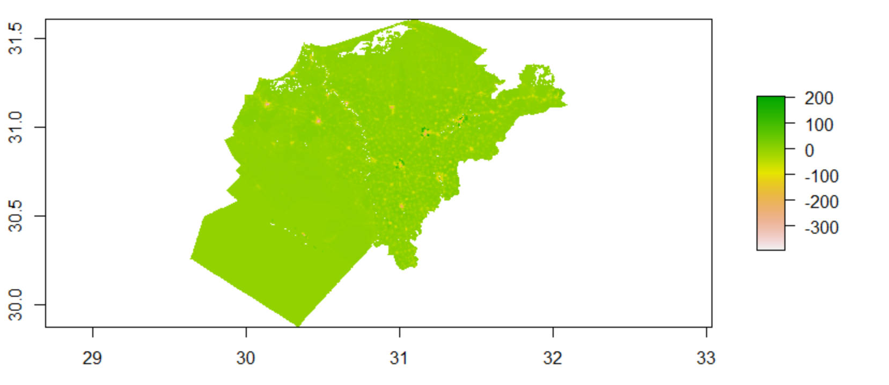

## Background

For this project, I continued on with my exploration of data from Egypt. However, due to its large population and computing constraints on my device, I opted to select six different subregions of Egypt to focus on for this analysis, in effort to create two models that are representative of small and large subdivisions when predicting these populations. Egypt consists of two major administrative boundaries, being divided into 27 governorates with over 300 further subdivisions; because of this I decided to run tests on two subsets of the data: one containing five small subregions of Egypt (Ad Daqahliyah, Al Buhayrah, Al Garbiyah, Kafr ash Shaykh, and Al Minufiyah), and one of the largest subregions, Matrouh. To make predictions for populations, we take into account the features of these geographical locations as well as the level of human activity that is taking place in these areas of Egypt. After aggregating all of the filese containing the data we will be working with, I began with 6,109,450 gridcells for the five small subregions and 32,628,528 gridcells for the single large subdivision. 

### Five smaller sub-regions- Ad Daqahliyah, Al Buhayrah, Al Garbiyah, Kafr ash Shaykh, and Al Minufiyah

### Single large sub-region- Matrouh

## Use two machine learning methods predict population values at 100 x 100 meter resolution throughout your selected country

### Linear Regression

To begin my analysis, I first used a linear regression model using the sum of various factors such as land use, night time lights, and settlement covariates to predict a population for these subdivisions, before comparing the actual versus predicted populations for these subdivisions in Egypt. This linear regression model utilized a 4/5 proportion for a training/testing split for predicting the population of these subregions on a 100 x 100 meter resolution.

#### Single Large Subregion- Matrouh

For my single large subregion, my linear regression model predicted a poulation of 492534.9, and had a real population total of 492481.6, with an absolute difference of 897176. Plots for the population sums and difference in sums are shown below.

From observing the plot of the difference between the actual and predicted populations shown below, it appears that the model performed fairly well at predicting populations, with only a few places that appear to have been underpredicted.

###### Difference between actual vs predicted populations

#### Five smaller subregions- Ad Daqahliyah, Al Buhayrah, Al Garbiyah, Kafr ash Shaykh, and Al Minufiyah

The figure below showcases the plot of the population sums of the five smaller subregions.

When looking at the predicted populations for the linear regression model, it's interesting to note a couple of things. First, it should be noted that the model performed moderately well for most of the region, but has localized points in which it grossly underpredicts, surrounded by a small ring in which it overpredicts. Besides the areas of the region that are taken up by lakes and rivers, this is likely due to the presence of cities and travel between the various administrative zones that make up the larger bounds of these cities.

For the five smaller subregions, my linear regression model predicted a population of 25,386,261, and had a real population total of 25,376,857, with an absolute difference of 17,892,728. This demonstrates that the linear regression model underpredicts the overall population of these regions. However, this model performs worse when compared to the previous model ran on the larger subregion.

###### Difference between actual vs predicted populations

### Random Forest

For this random forest regression model, I utilized the same geographic indicators as with the linear regression, utilizing 500 trees that tests four variations of our predictors at each split to predict the population for the various subregions at a 100 x 100 meter resolution.

It's interesting to note the differences in the variable importance plots for each of my two test regions. It appears that for both plots, sum.dst200, sum.ntl, and sum.topo are the least significant predictors when predicting for population. However, sum.dst040, sum.dst150, and sum.dst130 are the top three predictors for the five smaller subregions, while the larger subregion shares sum.dst130 in its top three alongside sum.slope and sum.water. It's possible that the combination of these factors play a different role when looking at regions of various sizes.

##### Single large Subregion- Matrouh

##### VIP Plot

##### Five smaller subregions- Ad Daqahliyah, Al Buhayrah, Al Garbiyah, Kafr ash Shaykh, and Al Minufiyah

####MSE,RSQ, MAE

## Validate the two models using different methods presented in this class
## Write a report assessing the two approaches and which of the two models was more accurate
## Be sure to account for spatial variation throughout your selected location and provide substantive explanations for why those variations occurred

## Discussion

Overall, it appears that 

