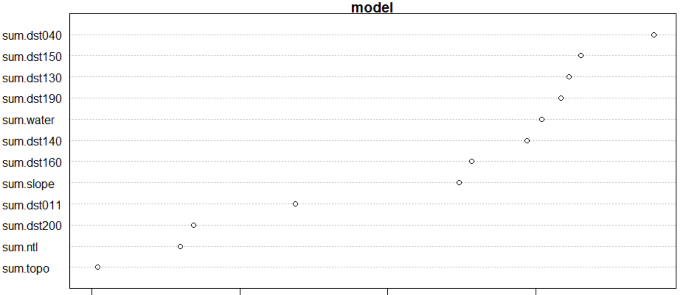

## Background

For this project, I continued on with my exploration of data from Egypt. However, due to its large population and computing constraints on my device, I opted to select six different subregions of Egypt to focus on for this analysis, in effort to create two models that are representative of small and large subdivisions when predicting these populations. Egypt consists of two major administrative boundaries, being divided into 27 governorates with over 300 further subdivisions; because of this I decided to run tests on two subsets of the data: one containing five small subregions of Egypt (Ad Daqahliyah, Al Buhayrah, Al Garbiyah, Kafr ash Shaykh, and Al Minufiyah), and one of the largest subregions, Matrouh. To make predictions for populations, we take into account the features of these geographical locations as well as the level of human activity that is taking place in these areas of Egypt. After aggregating all of the filese containing the data we will be working with, I began with      for the five small subregions and 32,628,528 gridcells for the single large subdivision. 

### Five smaller sub-regions- Ad Daqahliyah, Al Buhayrah, Al Garbiyah, Kafr ash Shaykh, and Al Minufiyah

### Single large sub-region- Matrouh

## Use two machine learning methods predict population values at 100 x 100 meter resolution throughout your selected country

### Linear Regression

##### Single Large Subregion- Matrouh

To begin my analysis, I first used a linear regression model using the sum of various factors such as land use, night time lights, and settlement covariates to predict a population for these subdivisions, before comparing the actual versus predicted populations for these subdivisions in Egypt. This linear regression model 

For my single large subregion, my linear regression model predicted a poulation of 492534.9, and had a real population total of 492481.6, with an absolute difference of 897176. Plots for the population sums and difference in sums are shown below.

To validate this, I 

##### Five smaller subregions- Ad Daqahliyah, Al Buhayrah, Al Garbiyah, Kafr ash Shaykh, and Al Minufiyah

### Random Forest

##### Single large Subregion- Matrouh

##### Five smaller subregions- Ad Daqahliyah, Al Buhayrah, Al Garbiyah, Kafr ash Shaykh, and Al Minufiyah

####MSE,RSQ, MAE

## Validate the two models using different methods presented in this class
## Write a report assessing the two approaches and which of the two models was more accurate
## Be sure to account for spatial variation throughout your selected location and provide substantive explanations for why those variations occurred
